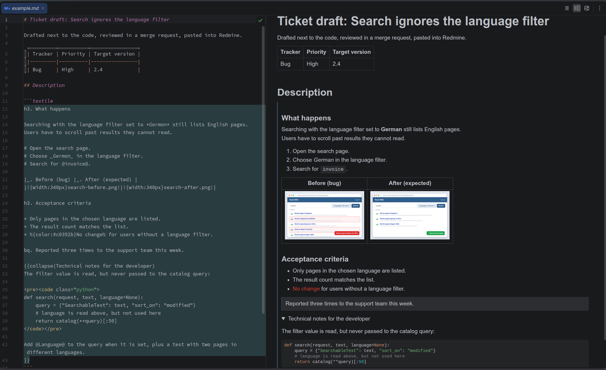

# Textile Preview for PyCharm

[](https://github.com/interaktivgmbh/pycharm-textile-preview/actions/workflows/build.yml)
[](LICENSE)


Write Textile inside Markdown files and see it rendered, live, in PyCharm's normal Markdown preview.



## Why

We write Redmine tickets as Markdown files next to the code: easy to review in Git, easy to
draft with an AI agent, easy to reuse. Redmine wants Textile, though, and PyCharm only previews
Markdown. So the ticket text sat in a code block and you could not see what Redmine would show.

Now you put the ticket text in a `textile` code block and the preview renders it:

````markdown
## Description

```textile
*Background*

Users without a location see an empty start page.

{{collapse(Technical notes)
* Check @get_locations()@ first.
}}
```
````

## Try it in two minutes

1. Download the ZIP from the [latest release](https://github.com/interaktivgmbh/pycharm-textile-preview/releases/latest).
2. In PyCharm: *Settings → Plugins → ⚙ → Install Plugin from Disk…*, no restart needed.
3. Clone this repository, open it as a project and open [`example/example.md`](example/example.md)
   in *Editor and Preview* mode.

## What you get

- Textile rendered in the preview you already use, updated while you type.
- Markdown before and after the block works as usual, other code blocks stay code.
- Redmine extras: `{{collapse(Label) ... }}` becomes a collapsible section, and `!image.png!`
  without a path is found in the folder of the Markdown file or below it (in Redmine these
  would be ticket attachments).
- Redmine code blocks like `<pre><code class="python">` are colored by the IDE's own syntax
  highlighter, in your color scheme, for every language your IDE knows.
- The copy button on the block copies the raw Textile, ready to paste into Redmine.

## How it works

The whole plugin is less than 200 lines of Kotlin, so it is easy to read and to fork.

The Markdown plugin hands every fenced code block to registered "fence providers". This is the
same mechanism that draws Mermaid and PlantUML diagrams in the preview.

| File | Job |
|---|---|
| [`TextileFenceProvider`](src/main/kotlin/de/interaktiv/textilepreview/TextileFenceProvider.kt) | Claims fences with the language `textile` and finds the folder of the Markdown file. |
| [`TextileRenderer`](src/main/kotlin/de/interaktiv/textilepreview/TextileRenderer.kt) | Turns Textile into HTML with [Mylyn WikiText](https://github.com/eclipse-mylyn/org.eclipse.mylyn/tree/main/mylyn.docs/wikitext), plus the Redmine bits. Code blocks go to the same highlighter that colors Markdown code fences. |
| [`TextileStylesExtension`](src/main/kotlin/de/interaktiv/textilepreview/TextileStylesExtension.kt) | Adds a stylesheet so the block reads like text, not like code. |

**Want a preview for another markup?** Mylyn WikiText also ships parsers for Confluence,
MediaWiki, TracWiki, TWiki, Creole and AsciiDoc. A first version for one of these mostly means
swapping the language class in `TextileRenderer` and the language name in `TextileFenceProvider`.
Pull requests and forks are welcome.

## Build from source

```bash
./gradlew test buildPlugin
```

The plugin ZIP lands in `build/distributions/`. Gradle downloads PyCharm 2026.2.3 and, if needed,
a Java 25 JDK (PyCharm 2026.2 is built for Java 25). To skip the IDE download, point
`platformLocalPath` to an installed PyCharm, for example in `~/.gradle/gradle.properties`:

```properties
platformLocalPath=/path/to/pycharm
```

`TextileRendererTest` checks the renderer alone. `TextileFencePreviewTest` runs the real HTML
generation of the Markdown plugin with this plugin loaded, without opening a window.

## Limits

- The extension point `org.intellij.markdown.fenceGeneratingProvider` is marked `Internal` and
  `Obsolete` by JetBrains. It works, but may change without notice. That is why the plugin is
  limited to build 262 (2026.2) and needs a check with each major IDE release.
- Only tested with PyCharm. Other JetBrains IDEs 2026.2 with the bundled Markdown plugin should
  work as well.
- The experimental Compose preview does not show the rendered block, the default preview does.
- The Markdown preview loads local images only for files inside the open project. This is a rule
  of the preview itself and applies to normal Markdown images as well.
- Mylyn is not Redmine's own Textile renderer (RedCloth), so small differences are possible.
  Issue links like `#1234` are not linked and nested `collapse` macros are not supported.

## License

MIT, see [LICENSE](LICENSE). The plugin ZIP bundles Mylyn WikiText (EPL-2.0) and its
dependencies Guava (Apache-2.0) and jsoup (MIT).

Made by [Interaktiv GmbH](https://www.interaktiv.de).
